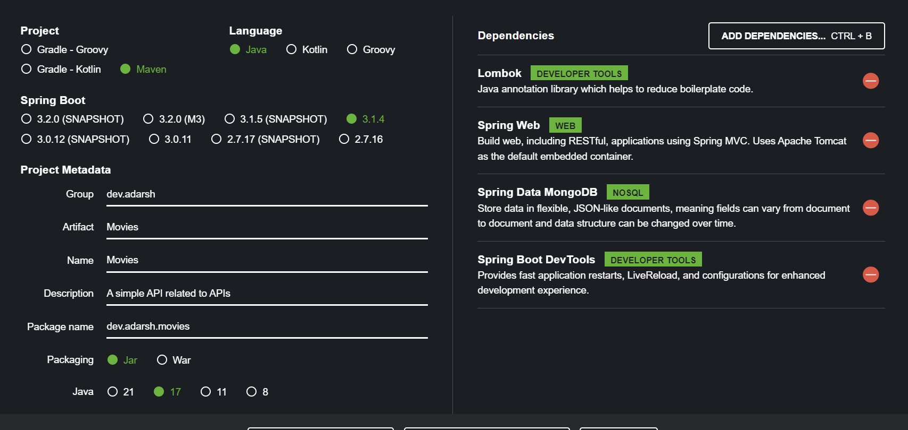

# Back-End Setup

## Steps

1. Create a project on mongo atlas inside of which create a database(shared) of AWS provider stating the region as ap-south-1(MUMBAI)
2. Create an username and password for the cluster for security purposes
    - Username: \<username>
    - Password: \<password>
3. Then you can connect to the mongodb using the uri: `mongodb+srv://<username>:<password>@cluster0.vwqr5vp.mongodb.net/`  
    Make sure to replace with your own password
4. After this you need to create a database(movies-api-db) and a collection(movies) inside it.
5. In order to populate the data, we will use a pre-existing file perfect for our use case [movies.json](../Resources/movies.json)

### Spring Initializer



6. Finally extract the zip and open the folder in Intellij IDEA
7. Add the following configs to application.properties:

```
server.port=8000
spring.data.mongodb.database=movies-api-db
spring.data.mongodb.uri=mongodb+srv://<username>:<password>@cluster0.vwqr5vp.mongodb.net/
```

8. Having all these information is not preferred so we can create a .env file which holds the sensitive information. Prepare a file as shown below:

```
MONGO_DATABASE=
MONGO_USER=
MONGO_PASSWORD=
MONGO_CLUSTER=
```

Have all the details in there then we will add this .env to .gitignore so we don't accidentally commit it to git.  
At last we will need to use this data inside the application.properties file so we need a maven dependency  
**NOTE:** Make sure to include the spring dotenv by Paul Schwarz(Specifically version 2.5.4)  
[Spring Dotenv](https://mvnrepository.com/artifact/me.paulschwarz/spring-dotenv/2.5.4)  
The final application properties will look somewhat like this:

```
server.port=8000
spring.data.mongodb.database=${env.MONGO_DATABASE}
spring.data.mongodb.uri=mongodb+srv://${env.MONGO_USER}:${env.MONGO_PASSWORD}@${env.MONGO_CLUSTER}
```

9. Apart from all these setup rest all is the code and the implementation, checkout the video for more details [Link](https://www.youtube.com/watch?v=5PdEmeopJVQ&t=13s)
