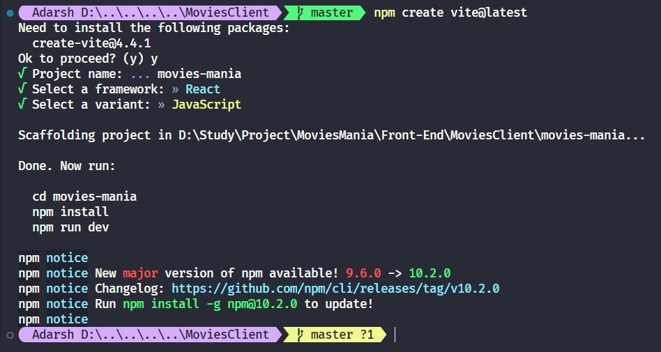
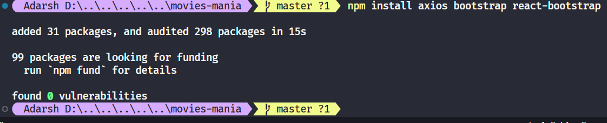
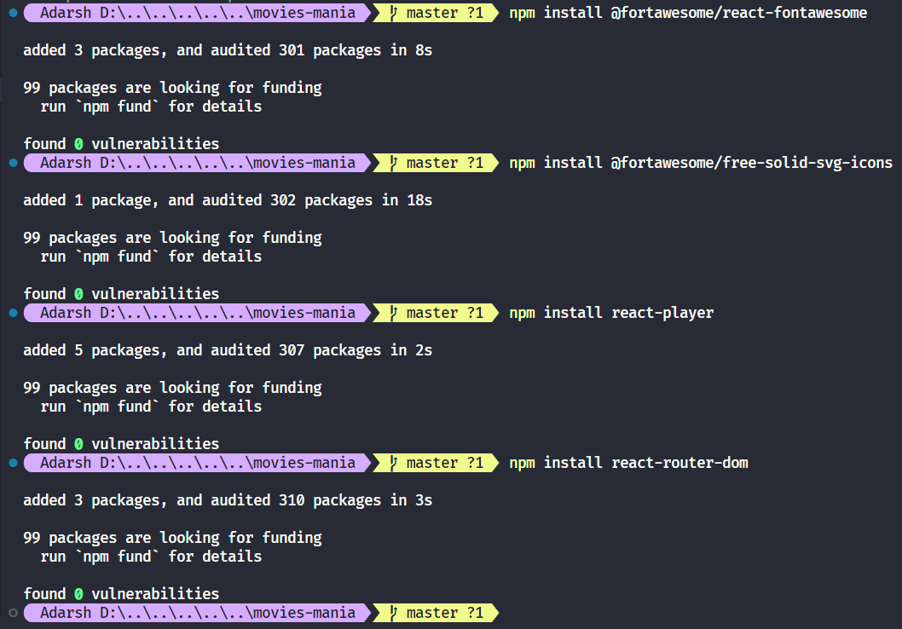
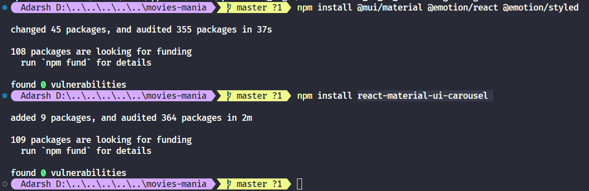

# Front-End Setup

## Steps

1. We will be using vite so in order to initialise a project in vite use `npm create vite@latest` and then fill in the following:  
      
    Here you get to choose the framework and the language as well between javascript and typescript.  
    Post which install the dependencies with the given instructions
2. Then you can start the app
3. We need few npm packages in our project to head start the dev process,
    - **axios**: To hit the APIs
    - **bootstrap**: For Styling
    - **react-bootstrap**: Compatibility with react
    - **@fortawesome/react-fontawesome**: For using icons in our project
    - **@fortawesome/free-solid-svg-icons**
    - **react-player**: For playing movie trailers inside our app
    - **react-router-dom**  
        \-**@mui/material @emotion/react @emotion/styled**: Material UI Styling  
        \-**react-material-ui-carousel**: Material UI Carousel Theme

  
  

4. If inside create-react-app add `import 'bootstrap/dist/css/bootstrap.min.css'` inside the index.js file else inside the vite app add `import 'bootstrap/dist/css/bootstrap.min.css'` inside main.js

5. Apart from all these setup rest all is the code and the implementation, checkout the video for more details [Link](https://www.youtube.com/watch?v=5PdEmeopJVQ&t=13s)
